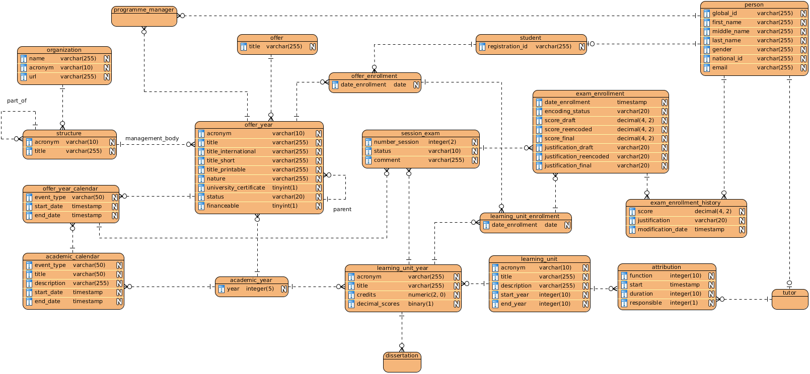

= Data Manual
Hildeberto Mendonça
v0.1, 2016-02-18
:toc: left

== Database Model

== Entities

=== Base
==== academic_calendar
==== academic_year
==== attribution
==== learning_unit
==== learning_unit_enrollment
==== learning_unit_year
==== offer
==== offer_enrollment
==== offer_year
==== offer_year_calendar
==== organization

OSIS is capable of managing multiple institutions in a single installation. All
of them are stored in the table `organization`, including the main organization.
This table also stores all partners of the institution, that includes other
universities, companies, professional schools and any other organization with
who the main institution has partnership with.

==== person
==== programme_manager
==== student
==== structure
==== tutor

=== Dissertation

==== dissertation

=== Internship

==== internship_enrollment
