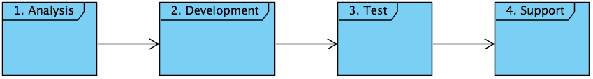
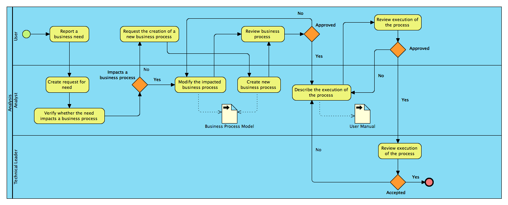
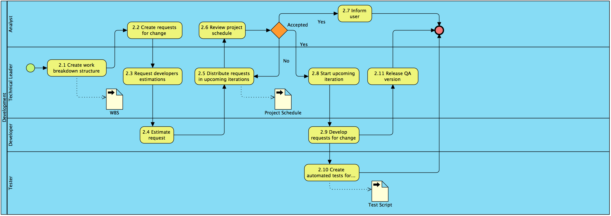
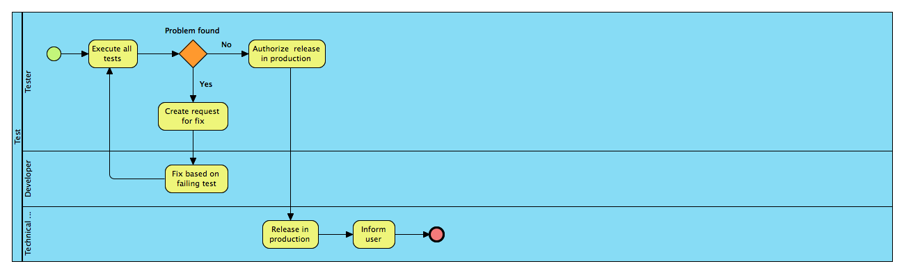

= Software Process at UCLouvain
Hildeberto Mendonça, PhD
:toc: right

:sectnums!:

== Introduction

=== Communication

OSIS is an open source software sponsored by Université catholique de Louvain. For being open source, the communication strategy changes from the traditional internal communication to a global and transparent one. People should consider not only the participation of the internal team, but also developers and users all around the world. Therefore, to allow global and transparent communication, we have to comply with the following rules:

 1. Communication directed to the local community can be done in English or in the native language.
 2. Communication directed to the global community should be done in English only.
 3. The code should be written in English only.
 4. The user interface is multilingual but it will initially support English and French. The support for additional languages depends on the adoption of the software and the contributions from the community.
 5. Since there is not private source, all the communication is done using public channels such as mailing lists, chats, wikis and others.
 6. To be taken into account, a communication should be registered textually and preserved historically. Direct email communication between two or a subset of the team is not considered valid because all stakeholders should be equally informed.

To support the communication rules, we have created the following channels:

The team that maintains the context-free module communicates through the chat
https://gitter.im/uclouvain/OSIS in English only.

The team that discusses the context-specific module communicates through the chat
https://gitter.im/uclouvain/OSIS-Louvain in English or in French, the local native language.

The development community communicates through the group
https://groups.google.com/d/forum/osis-dev in English only.

The users community communicates through the group
https://groups.google.com/d/forum/osis-user in English or in French.

News about the project can be found at: http://uclouvain.github.io/OSIS/.

Development statistics about the project can be found at
https://www.openhub.net/p/OSIS.

Organizations that support the development of OSIS through a context-specific module can follow their own internal rules of communication.

=== Macro-processes

Our software methodology is composed of 4 processes: *Analysis*, *Development*, *Test*, and *Support*. These processes run in two parallel iterations and one on-demand execution.

The iteration of the analysis lasts for 2 weeks. This iteration is independent from the development, so analysts do not have to wait for the outcome of the development to advance with their analysis. It also means that we expect a release coming out from each iteration, just like application releases. Therefore, the analysis should be planned, executed, integrated, tested and released, as traditionally done with code.

Development and test are in the same iteration because everything that is developed should be tested before going into production. The tests should be done by someone else not directly involved on the development of the ongoing version. This iteration also lasts from 2 weeks and occurs in the same time frame of the analysis. The output of the analysis serves as input for the development and test. However, the output is accumulated in a backlog before being allocated in the upcoming development iterations.

The support is an on-demand process, executed only when an issue in production is reported. Every issue starts an independent instance of the process. There is no fixed duration of the execution, but it has higher priority than other processes and the minimal waiting time is 12 working hours.

More details about each one of these processes are described in the following sections.

:sectnums:

== Analysis

=== Report a business need
=== Create request of need
=== Verify the impact on existing business processes
=== Modify the impacted business processes
=== Request the creation of a new business process
=== Create a new business process
=== Review business process
=== Describe the execution of the process

During this activity, analysts are actually writing the user manual.

For the purpose of traceability, every new section or modification in an existing section should have a dedicated branch.

=== Review the execution of the process
=== Verify technical feasibility

== Development

=== Create work breakdown structure
=== Create requests for change
=== Demand developers estimations
=== Estimate requests

These are the types of effort:

- *Unknown*: the team does not have the necessary knowledge to address the issue. Therefore, an investigation should be carried out and no extimation can be done.
- *Complex*: the team has the necessary knowledge to address the issue but cannot estimate when the work will be finished.
- *Heavy*: the team has the necessary knowledge to address the issue and estimate the work but the issue cannot be solved in less than 5 working days.
- *Regular*: the team has the neccessary knowledge to address the issue and estimate the work but the issue cannot be solved in less than 2 days.
- *Easy*: the team has the necessary knowledge to address the issue, estimate the work and finish it in less than 2 days.
- *Flash*: the issue can be solved in a couple of hours.

=== Distribute requests in upcoming iterations
=== Review project schedule
=== Inform user
=== Start upcoming iteration
=== Develop requests for change

The last person allocated in a ticket is the only one authorized to close that ticket.

=== Create automated tests for change
=== Release QA version

== Test

=== Execute all tests
=== Create request for fix
=== Fix based on failing test
=== Update user manual
=== Authorize release in production
=== Release in production
=== Inform user

== Support

=== Report application issue
=== Create reproduction test script
=== Create request for fix
=== Prioritize and allocate request
=== Fix based on failing test
=== Execute all tests
=== Authorize release on production
=== Release in production
=== Inform user

:sectnums!:

[glossary]
== Glossary

Atom:: A very simple text editor to be used on the writing of the user manual and on the development of the applications.

Context-free module:: A module that unifies the domain of higher education but doesn't consider the context where it is applied.

Context-specific module:: A module that inherits the domain from the context-free module and implement context's needs based on the local culture, law enforcements, integration with local systems and so on.

Git:: A distributed version control system.
GitHub::
Odoo::
Planner::
Python::
Runbot::
Selenium::
Visual Paradigm::

[bibliography]
== Bibliography

- [[[evans2004]]] EVANS, Eric. Domain-Driven Design: Tackling Complexity in the Heart of Software. Addison Wesley: Boston, 2004.
  2008.

Copyright (c) 2015 Université catholique de Louvain. All Rights Reserved.
