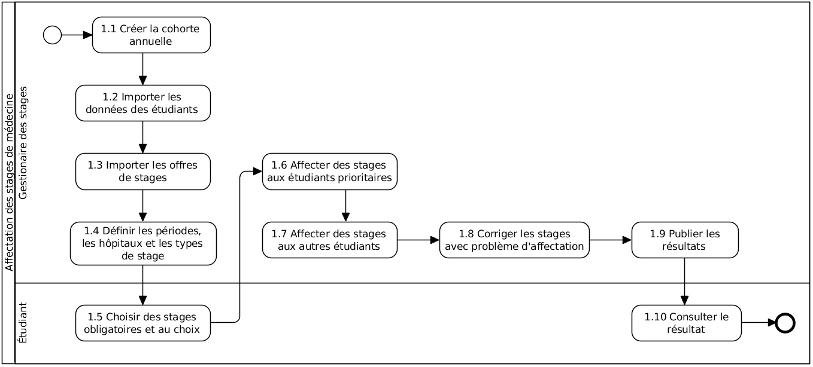

== Les fonctionnalités

=== L'affectation des stages

Chaque année des étudiants de la faculté de médecine doivent effectuer 12 périodes de stages (1 période par mois). Les stages sont divisés en 2 catégories:

1. *Stages obligatoires*: des spécialités imposées à tous les étudiants avec des périodes de un à deux mois.

2. *Stages au choix*: des spécialités au choix limités à 1 mois par spécialité. L'étudiant peut choisir 4 fois la même spécialité ou 4 spécialités différentes. La priorité est donnée aux étudiants qui présentent un concours dans la spécialité choisie pour le stage au choix. L'information concernant la spécialité du concours est fournie par l'étudiant au moment de l'inscription. Seulement 2 stages au choix sont prise en consideration pendant l'affectation. Les autres 2 choix sont des sauvegardes pour le cas ou il n'y a plus de places disponibles.

Voici le tableau qui montre un exemple des stages et leurs périodes respectives.

.Exemple de répartition des stages
|===
|Spécialité |Périodes

|Médecine interne (MI) 2 mois
|P1, P2

|Urgence (UR) 2 mois
|P3, P4

|Chirurgie (CH)
|P5

|Gynécologie-obstétrice (GO)
|P6

|Pédiatrie (PE)
|P7

|Médecine interne 1 mois
|P8

|Gériatrie
|P9

|Stages au choix
|P10, P11
|===

Pour affecter les étudiants aux différents stages offert par les hôpitaux dans les périodes bien déterminées, la faculté suivra le processus suivant une fois par an, au début de l'année, entre janvier et février:

En plus d'expliquer le business de manière explicite, le processus nous aide également à identifier les rôles et les tâches pour lesquels ils sont responsables. Avec cela, les autorisations peuvent être assignées correctement.

Voici une description détaillée des toutes les tâches du processus:

[#creation_cohort]
==== Création d'une cohorte

La *Cohorte* est utilisée pour définir la période annuelle d'organisation des stages. Cette période ne coïncide pas avec l'année académique et sa gestion est tout à fait spécifique au domaine des stages de médecine. Elle est crée un an a l'avance pour être bien planifié.

La création d'une cohorte est le premier pas vers l'affectation des stages. Presque toutes les données sont liées à celle-ci. À cette étape, le gestionnaire des stages va créer une cohorte en fournissant les informations telles que demandées par le formulaire suivant.

image::images/cohort-creation.png[Création de cohort]

Les dates d'ouverture et de fermeture permettent de contrôler l'accès aux inscriptions aux stages pour les étudiants disposant d'un matricule. La date de fermeture est toujours postérieure ou équivalente à la date d'ouverture. La date de publication, quant à elle postérieure à la date de fermeture des inscriptions, permet de publier les informations d'affectation aux étudiants. Après la date de publication, c'est ne plus possible d'affecter les étudiants automatiquement.

Le gestionnaire a l'option de créer une cohorte à partir d'une cohorte existante. Cela lui permet de réutiliser une bonne partie des données disponibles. Les données réutilisées sont les hôpitaux, les spécialités, les périodes, les types de stages et les maîtres de stages.

[#import/students]
==== Importation des étudiants

Grâce à l'importation de données a partir d'un fichier XLS, il n'est pas nécessaire de demander aux étudiants de s'inscrire sur l'application. Le fichier provient de l'application de gestion de l'université et contient les étudiants inscrits sur le programme de master en médecine, essentiel pour la démarche du processus d'affectation.

image::images/students-empty.png[Pas d'étudiant dans la cohorte]

L'importation des étudiants est disponible dans la page de consultation des étudiants. En cliquant sur le bouton "Importer", une fenêtre modal s'ouvre pour permettre la sélection du fichier Excel (xlsx) disponible sur la machine de l'utilisateur. Après la sélection, cliquez sur le bouton "Importer" en bleu pour démarrer l'importation. Le temps d'importation dépend du nombre d'étudiants dans le fichier à importer.

image::images/students-import.png[Importation des étudiants]

C'est important d'importer un fichier en format `xlsx` parce que l'application n'est pas compatible avec le format `xls`. Pour avoir un fichier `xlsx` à partir d'un fichier `xls`, vous pouvez ouvrir le ficher `xls` en Excel et _Enregistrer sous_ le format `xlsx` en sélectionnant l'option _Classeur Excel_, qui est la premier dans la liste.

image::images/xls-to-xlsx.png[Convertion de xls vers xlsx]

Après l'importation, les étudiants apparaissent dans la liste, comme illustré dans l'image suivante. C'est possible d'ajouter un nouveau étudiant an cliquant sur "Ajouter". C'est également possible de visualiser et modifier un étudiant existant en cliquant sur le bottom de la colonne "Détails". Plus tard dans le processus, c'est possible de modifier les choix fait par l'étudiant en cliquant sur le bottom dans la colonne "Modification des choix".

image::images/students-imported.png[Les étudiants importés dans la cohorte]

[WARNING]
====
La réimportation des étudiants ira dissocier tous les étudiants existants de la cohorte, sauf les insérés à la main. Après la premier importation, c'est recommandé de maintenir les données des étudiants via les fonctionnalités disponible dans l'application.
====

==== Importation des offres de stages

Il est préférable de gérer les offres de stages (la quantité de places disponibles dans chaque hôpital pour chaque spécialité) dans un fichier Excel. Cette fonctionnalité permet d'exploiter les données du fichier dans l'application.

image::images/offers-import.png[Importation des offres de stage]

En cas de changement de la quantité des places disponibles, les modifications sont faites dans le même fichier Excel et réimportés dans l'application. En option, les quantités peuvent être modifiés directement dans l'application, mais en cas de réimportation du fichier Excel les données modifiés manuellement seront écrasés.

image::images/spreadsheet-places.png[Le fichier Excel avec des places disponibles]

NOTE: Malgré l'ordre d'importation de données afficher dans le processus et documenté dans les sections 1.1.2 et 1.1.3, les étudiants et les offres peuvent être importé n'importe en quel ordre, parce que les données ne sont pas initialement associés. Ils seront associés seulement après les choix et les affectations des étudiants.

==== Définition des périodes, des hôpitaux et des stages

Avec l'intention d'organiser la cohorte pour permettre le bon choix des étudiants est l'affectation en suite, le gestionnaire des stages s'occupe de déterminer les dates de debut et fin de la période des choix des stages et la date de début de publication des résultats. Les dates sont déterminés dans l'écran d'édition de la cohorte.

WARNING: Les quatre dernières tâches (1.1.1, 1.1.2, 1.1.3, 1.1.4) devraient se terminer avant la date de debut de la période de choix des stages.

==== Choix des stages obligatoires et au choix

Précisément à la date de debut de la période de choix, l'application est ouverte aux étudiants de médecine qui devront faire leurs choix de stages. L'application reste ouverte jusqu'à la fin de la période. Pendant ce temps là, les étudiants peuvent changer librement leurs choix et le gestionnaire des stages peux consulter les choix fait, mais pas les modifier avant la fin de la période d'inscription.

L'étudiant a accès a l'application seulement s'il:

* est régulièrement inscrit comme étudiant à l'université
* a un compte utilisateur pour accéder le réseau et les services en ligne du portail
* est régulièrement inscrit dans une des cohortes existants.

Lorsque l'étudiant se rend sur la page d'accueil du portail, il a accès a une liste de fonctionnalités: le choix des stages, la liste des hôpitaux, le bilan de choix de stage et d'affectation finale.

Sur le choix des stages, les onglets des différentes spécialités sont présentés.

image::images/choix-stages.png[Le choix des stages par l'étudiant]

Pour les spécialités obligatoires, dans chacun de ces onglets se présentent plusieurs hôpitaux. L'étudiant doit effectuer 4 choix d'hôpital (du 1er au 4ème choix) selon sa ordre de préférence). Une fois ces 4 choix effectués dans chaque onglet, il faut cliquer sur le bouton "Soumettre" qui se trouve au bas de la page pour enregistrer les choix. Un erreur se produit si l'utilisateur fait plus de 4 choix ou deux fois le même choix.

Pour les stages au choix, il est possible de faire 4 choix de spécialités. Pour chaque une, l'application propose à l'étudiant les hôpitaux disponibles pour ce stage au choix. Les choix sont limités à 4 hôpitaux. Si le système ne propose rien, c'est que cette spécialité n'est pas disponible. Si l'étudiant sélectionne un stage en médecine générale, il faut choisir l'hôpital "Médecine générale" en premier choix puisqu'il n'y a pas d'autre possibilité. Idem pour les spécialités où il n'existe qu'un hôpital. Ce "premier choix" concerne bien l'hôpital et pas la spécialité, la préférence de celle-ci étant déterminée par le numéro du stage au choix.

Lorsque l'étudiant sélectionne un hôpital dans une spécialité, un compteur l'informe sur le nombre de places totales disponibles et le nombre d'étudiants ayant déjà choisi cet hôpital en premier choix. Plus la demande dépasse l'offre, plus la probabilité d'obtenir cette affectation est faible.

==== Affectation des stages aux étudiants prioritaires

Une fois que les inscriptions sont fini, l'affectation des étudiants prioritaires commencent. Les étudiants sont reconnus comme prioritaires par le service d'aide aux étudiants. Cela donne une priorité adaptée au besoin particulaire de chaque étudiant, mais il n'y a pas d'assurance de recevoir les premiers choix. Le plus souvent, c'est de prioriser les stages proches du domicile légal ou dans un hôpital avec logement.

L’étudiant devra faire ses 4 choix de manière réfléchie et se présenter à la faculté dans une période bien définie afin de discuter avec le secretariat des critères qui lui sont propres. Après cette discussion, le secretariat déterminera parmi les choix faits par l'étudiant celui ou ceux que l'application devra obligatoirement prendre en compte. Le gestionnaire de stages reserve le droit d'imposer un stage selon les disponibilités réel, mais toujours en adéquation avec le besoin de l'étudiant.

La date qui determine la fin de l'affectation aux étudiants prioritaires et les autres affectations n'est pas bien precise. Tout la partie des affectations se déroule après la date de fin des inscriptions e date de debut des publications.

==== Affectation des stages aux autres étudiants

Pour les étudiants non-prioritaires, les affectations sont faites automatiquement par l'application. L'algorithme essaye de trouver une solution optimale pour chaque étudiant en terme de spécialité et période. Certaines contraintes empêchent de respecter le premier choix de tous les étudiants. Par exemple, si le nombre d'étudiants est plus grand que le nombre de places disponibles. Pour satisfaire au mieux toutes les demandes des étudiants avec les offres limitées, nous essayons de trouver une solution satisfaisant le coût le plus faible possible et qui satisfait les différentes contraintes, tout en respectant le mieux possible les souhaits des étudiants.

==== Correction des stages avec problème d'affectation

L'affectation automatique peux rencontrer des difficultés pour affecter certains étudiants à cause des contraintes existantes. Les étudiants sont alors affectés temporairement à un hôpital fictif (hôpital erreur) pour être facilement identifiés pour une affectation manuel à la suite.

Le but de cette tache c'est de trouver une solution pour les étudiants avec problème d'affectation. Le gestionnaire de stages change manuellement les affectations existants.

Toutes les affectations devrons être réalisées avant la date de publication des résultats.

==== Publication des résultats

À la date de publication des résultats, définie dans le cohorte, tous les résultats sons publiés en même temps sur le portail de l'université et mis à disposition des étudiants impliqués.

==== Consultation des résultats

Les étudiants se connectent sur le portail pour consulter les résultats des affectations. Les données sont disponibles en mode lecture. En cas de correction ou de modification en général, une demande devra être fait au secretariat.

=== La gestion journalière

La gestion journalière couvre toutes les fonctionnalités de maintenance de données en dehors de l'exécution du processus. Ce sont les fonctionnalités utilisées au cours de l'année par le gestionnaire des stages.

==== Les hôpitaux

La gestion des hôpitaux ne se contente pas uniquement de maintenir les données des hôpitaux à jour.

Pour accéder aux rapports en format Excel pour les hôpitaux, cliquez sur le bouton vert indiquant les résultats de l'affectation.

image::images/hospitals-view.png[La liste des hôpitaux]

Dans l'écran de résultats de l'affectation, deux boutons sont disponibles pour produire le rapport:

1. pour les mètres de stage avec les affectations groupés par spécialité et période.
2. pour l'hôpital avec une liste des tous les affectation trié par période.

image::images/hospital-affectation-results.png[Les rapports pour l'hôpital]

Le rapport pour l'hôpital peux être configuré dans le formulaire de l'hôpital afin de prendre en compte les besoins de chacun.

Un champ numérique est disponible pour chaque donnée concernant les hôpitaux. Ces champs contiennent la sequence dans lequelle les données doivent être affichées. Les champs laissés vides sont ignorés.

image::images/hospital-report-config.png[La configuration de rapport pour l'hôpital]

==== Les spécialités

La gestion des spécialités consiste à maintenir les données des spécialités d'une cohorte. Généralement, les spécialités sont créées automatiquement au moment de la création d'une cohorte a partir d'une cohorte existant. Il suffit ensuite d'adapter la liste au cohorte actuelle en supprimant ou ajoutant des spécialités.

image::images/specialties.png[Les spécialités]

* *Les offres de stages*: maintenir les places disponibles dans les différentes spécialités des hôpitaux.

* *Les stages*: maintenir les différents types de stages.

* *Gestion des maîtres de stage*: pas encore disponible, mais bientôt le gestionnaire pourra maintenir les données des maîtres de stage.

* *Bilan des assignations*: un rapport comprenant les affectations des étudiants dans les hôpitaux, classé par spécialité.

* *Assignation des stages*: les modifications dans les affectations de stages selon les particularités de chaque étudiant, principalement les cas de permutation des stages.
