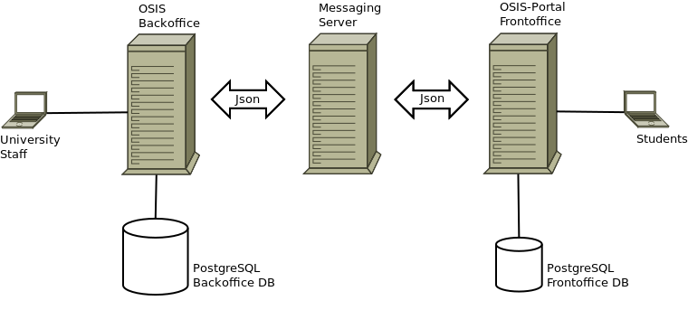

== La technique

=== La conception de l'application

==== L’algorithme d’affectation

Pour de satisfaire toutes les demandes des étudiants nous essayons de trouver une solution avec le coût le plus faible et qui satisfait les différents contraintes. Le coût est mesuré par la somme de tous les points d'une solution. Les points sont ajoutés à une solution quand les contraintes ne sont pas respectées. La pondération des différents contraintes est la suivante:

.Pondération des contraintes
|===
|Choix | Point

|Premier
|0

|Deuxième
|1

|Troisième
|2

|Quatrième
|3

|Hors choix
|10
|===

Quand les désidératas des étudiants ne peuvent pas être respectés, un autre lieu stage doit être imposé. L'étudiant sera placé dans l'hôpital proche de son adresse légale. Cette solution ajoute 10 points (hors choix) + 1 points par 50 kilomètre entre son adresse légale et l'adresse de l'hôpital.

Chaque étudiant doit choisir 6 stages au choix, par ordre de préférence, de 1 à 6. Seulement 4 stages seront pris. S'il est impossible de respecter les 4 premiers choix on va ajouter 2 points pour le choix 5 et 3 points pour le choix 6.

On a également les différentes contraintes faibles, par exemple l'étudiant doit faire au minimum 2 mois dans le même hôpital. Si ce n'est par le cas on ajoute 5 points.

===== Les définitions

* *L’offre* est représentée par un ensemble de stages qui sont proposées par les différents acteurs. Chaque stage possède une spécialité, un lieu, une période et un nombre de places minimales et maximales.

* *La demande* est représentée par un ensemble des choix des étudiants. Elle est divisée en 2 catégories:

** Les stages obligatoires: chaque étudiant pour chaque spécialité obligatoire doit donner une liste ordonnée de 4 lieux de stages, par ordre de préférence allant de de 1 à 4.

** Les stages au choix: chaque étudiant doit choisir 6 spécialités au choix, par ordre de préférence allant de 1 à 6. Si l’étudiant souhaite, il peut   choisir plusieurs fois la même spécialité.  Ensuite pour chaque spécialité, l’étudiant doit donner une liste ordonnée de 4 lieux de stages, par ordre de  préférence allant de de 1 à 4.

* *Une solution* c’est un ensemble des différents choix qui satisfont au mieux toutes les demandes des étudiants. Elle doit respecter toutes les contraintes fortes et un maximum de contraintes souples. Dans une solution on retrouve, pour chaque étudiant, un triplet qui contient une spécialité, un lieu et une période.

* *Les contraintes fortes*:

** chaque étudiant doit avoir 12 périodes (P) de stages attribuées et réparties sur 12 mois (1 période par mois). Les stages se répartissent obligatoirement comme suite en «stages obligatoires» (8 P) et "stages au choix" (4 P).

** les stages obligatoires doivent se dérouler dans la première partie de l’année  (janvier – aout) et être suivis par les stages au choix (septembre – décembre).

** Pour les stages au choix, la priorité doit être donnée aux étudiants qui présentent un concours dans la spécialité choisi pour le stage au choix.

** Pour les étudiants prioritaires, il faut pouvoir attribuer manuellement certains stages (spécialité, lieu, période), avant l’attribution par le   logiciel, des stages aux étudiants. Les étudiants prioritaires pour lesquels, pour certaines spécialités, le lieu est unique et doit donc impérativement être respecté. Les modifications manuelles ne pourront pas être modifiées par le logiciel.

** Les 2 périodes de stage obligatoire «Urgence», doivent être effectuées l’une à la suite de l’autre dans un même hôpital.

* *Les contraintes souples*:

** Il faut éviter que l’étudiant ne passe qu’un mois dans un même hôpital. Si cette contrainte n’est pas respectée on ajoute une pénalité de 5 points.

** L’étudiant émet des désidératas concernant le lieu de stage obligatoires et concernant la spécialité et les lieux de stages au choix. Ces désidératas   devraient être respectés le plus possible en fonction d’un ordre de préférence allant de 1 à 4. Si le 1er choix n’est pas respecté, on ajoute:

*** 1 point de pénalité pour le 2ème choix
*** 2 points de pénalité pour le 3ème choix
*** 3 points de pénalité pour le 4ème choix

** En cas d’impossibilité de respecter les désidératas des étudiants, un autre lieu stage doit être imposé. L’étudiant sera placé dans l’hôpital proche de son adresse légale. On ajoute une pénalité de 10 points + 1 point par 50 kilomètre entre son adresse légale et l’adresse de l’hôpital.

** Chaque étudiant doit choisir 6 stages au choix, par ordre de préférence allant de 1 à 6. Seulement 4 stages seront pris, s’il est impossible de   respecter les 4 premiers choix de stage on va ajouter:

*** 2 points de pénalité pour le choix 5
*** 3 points de pénalité pour le choix 6

** Si l’offre est plus petite que la demande, certains étudiants seront ajoutés dans un hôpital fictif nommé «error», cet hôpital possède une capacité   infinie. Si cette contrainte n’est pas respectée (l’offre < la demande) on ajoute une pénalité de 1000 points.

==== Modèle de données

Les données sont organisés dans la base de données selon le modèle de données suivant.

image::images/internship-erm.png[Internship Entity Relationship Model]

===== period_internship_places

Cette table est peuplée par l'importation du fichier Excel avec le nombre de places disponibles dans chaque spécialité de chaque hôpital. C'est pour ça que si l'algorithme n'arrive pas au but les données ne plus affichés.

===== internship_student_affectation_stat

Cette table est peuplée par l’exécution de l'algorithme d'affectation. Chaque fois que l'algorithme est exécuté pour une cohorte, le donnée correspondent à cette cohorte est supprimé tout au debut de l’exécution.

==== L'architecture logiciel

La gestion des stages est une app Django. Elle ne tourne pas tout seule, mais elle depend d'un projet Django pour fonctionner. Pour le moment, elle depend du projet Django OSIS (https://github.com/uclouvain/osis), especifiquement de l'application `base`, qui est commun à tous les autres applications. C'est fortement couplé au point de être aimablement classée comme un "satelite" d'OSIS. Heureusement, l'application est conçue de manière à pouvoir être facilement découplée à l'avenir en utilisant, par exemple, des services web parce la demande de données est très faible.

==== Sécurité

Toutes les fonctionnalités de l'application sont limitées aux utilisateurs et aux responsabilités bien connus. À cause de ça, la sécurité de l'application est organisé en deux parties:

===== L'authentification

OSIS utilise le single-sign-on de l'UCL qui est integré avec le cadastre unique des utilisateurs informatique de l'université. L'application Internship hérite ce mechanism d'OSIS pour s'assurer qui tous les accès sont connu de l'instituition. Il n'y a aucun moyen de créer de nouveaux utilisateurs dans l'application, sans passer par les processus standard de l'université.

===== L'authorisation

L'authorisation est gérer par Django, qui organise les utilisateurs dans les groupes correspondent aux roles défini par l'application. Il y a deux rôles actuellment:

* *Gestionaire de stages*: il peut accèder les fonctionalités lié à la gestion de stages du coté OSIS Backoffice, mais pas à la partie de choix des stages du coté OSIS Frontoffice. L'accès au backoffice est limité au reseau UCL.
* *Étudiant*: il peut accèder les fonctionalités lié aux choix des stages du coté OSIS Frontoffice, mais pas à la partie de gestion de stages du coté OSIS Backoffice. L'accès au frontoffice est integré au portail UCL, donc il est ouvert au monde exterieur.

==== Déploiement

:sectnums!:

== Les annexes

=== Greedy

La construction de la solution se faire en 5 étapes. A chaque étape on parcourt chacune des modalités de stage. Pour chaque spécialité on parcourt tous les étudiants. Pour éviter que les étudiants au début de la liste aient toujours leur premier choix (premier arrivé, premier servi), nous allons commencer le parcours à un endroit choisi au hasard. La suite des opérations est différente pour chaque étape.

==== Étape 1: Stages obligatoires - Etudiants prioritaires Erasmus

Pour ces étudiants les stages (la spécialité, le lieu et la période) sont fixés. On les ajouté dans la solution initiale tel quel.  Pour chaque stage ajouté on met à jour le nombre de places disponibles pour un lieu / période / spécialité donné (table de stages).

==== Étape 2: Stages obligatoires - Etudiants prioritaires sociaux

Ces étudiants ont déjà une spécialité et un lieu choisis. L’algorithme doit choisir seulement la période de stage. Pour le choix de période on favorise les solutions qui permettent d’avoir au moins 2 mois de stage consécutifs dans un même hôpital.

Pour chaque période disponible, l’algorithme va regarder les périodes P – 1 et P + 1 et vérifier si une de ces périodes périodes est déjà attribuée à l’étudiant dans ce même hôpital. Si ce’est le cas, la période est candidate. Ensuite parmi les périodes candidates, on va choisir les périodes qui ont plus grand nombre de places disponibles. Si plusieurs périodes on le même nombre d’offres, on choisit une période au hasard. Pour fini on met à jour la table de stages.

Voici un exemple:

* Si c’est le premier stage de l’étudiant dans cet hôpital, on choisit les périodes dont P-1 et P+1 sont encore libres (afin de favoriser les deux mois  consécutifs dans un même hôpital). Si ex-equo, on choisit la période qui a le  plus grande nombre de places. Dans l’exemple c’est sont les périodes P2, P5 et  P6 (bleu) avec à chaque fois 23 places disponibles. Ensuite on choisit une  période au hasard parmi P2, P5 et P6 et on décrémente le nombre de places  disponibles. Les périodes en rouge ne sont pas disponibles, par exemple si une  spécialité n’est pas disponible.

image::images/greedy-example.png[Example 1]

* Si l’étudiant a déjà d’autres stages dans l’hôpital, on va favoriser les  périodes qui sont adjacentes avec les autres périodes de l’étudiant dans cet  hôpital. Dans l’exemple on voit que l’étudiant a déjà fait 3 autres stages  pendant les périodes P1, P4 et P8 (en vert), dans ce cas-là on va favoriser  les stages P2, P5 et P7 (en bleu). Ensuite parmi ces 3, on va choisir les  périodes qui ont la plus grande nombre de places disponibles (P2 et P4). Elles  ont toutes les deux 23 places disponibles, dans ce cas on choisit une période  au hasard parmi ces deux-là.

image::images/greedy-example-2.png[Example 2]

==== Étape 3: Stages obligatoires pour les étudiant régulière

Pour ces étudiants, pour la spécialité concernée, l’algorithme doit choisir un lieu et une période. Premièrement, il faut choisir un lieu. L’algorithme va toujours essayer de faire un choix qui minimise le coût total de la solution. Par exemple le premier choix n’est pas toujours le meilleur option, parfois c’est mieux de choisir le 2ème, 3ème ou même 4ème choix et avoir 2 stages consécutifs. Ensuite, la période est choisie de même manière que précédemment (-> Stages obligatoires - Etudiants prioritaires sociaux).  Pour finir on met à jour la table de stages.

YDE : On pourrait être proactif et favoriser un second ou 3ème choix qui permet d’avoir deux mois consécutif dans le même hôpital.
