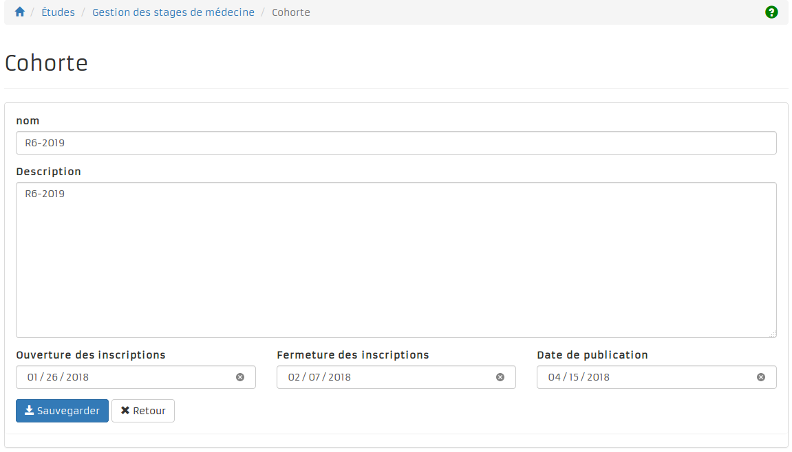
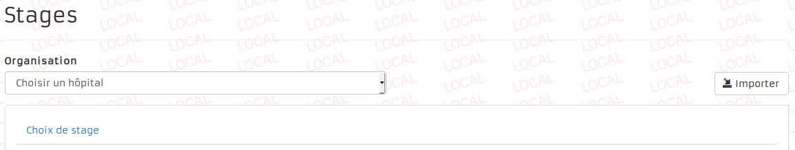
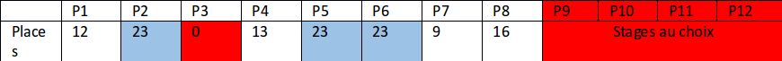
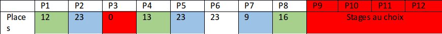

= Open Student Information System : Stages de médecine
Hildeberto Mendonça <hildeberto.mendonca@uclouvain.be>
v1.0, 2017-11-03
:toc: left
:toclevels: 4
:numbered:

:sectnums!:

== Introduction

L'objectif de ce document est de communiquer le métier de gestion des stages au
sein de la faculté de médecine et décrire le fonctionnement de l'application
développé dans le but de optimiser la charge de travail consacré a l'affectation
des stages.

Chaque nouvelle personne qui débarque dans le projet rencontre le défi de tout
comprendre en posant les mêmes questions encore et encore. Si bien fait et bien
maintenu, ce document aidera la faculté de médecine à évoluer s'application
proprement et continuellement, indépendant du changement de l'équipe, tout en
protégeant l'investissement déjà fait.

=== Le contexte

La *Faculté de médecine et médecine dentaire* (MEDE) faire partit du *Secteur
des sciences de la santé* (SSS) de *l'Université catholique de Louvain* (UCL).
Leurs activités sont, en général, réaliser au campus de Wolluwé, Bruxelles.

Les stages sont prévu comment une activité d'unité d'enseignement dans le
programme annuelle de formation de l'université. C'est une activité complexe,
gérer par la *Commission de gestion des stages en médecine*, qui s’assure de la
qualité des stages proposés aux étudiants et fait des propositions pour
l’amélioration des stages, tant pour la qualité pédagogique que pour le confort
matériel et la sécurité. Elle entretient une coordination avec le responsable
académique mobilité et avec le responsable de la coopération avec les pays en
voie de développement pour l’organisation de stages à l’étranger. Elle veille à
une répartition des étudiants parmi les lieux de stages conforme à la justice,
aux besoins pédagogiques individuels des étudiants, en tenant compte des besoins
particuliers des divers maîtres de stage, et en veillant à un juste équilibre
entre les stages extra-muros et dans les cliniques universitaires. Elle apporte
aux maîtres de stage son assistance pour l’évaluation des étudiants qui leur
sont confiés.

=== Les acteurs

Les acteurs impliqué dans la gestion des stages sont:

* les étudiants inscrits aux programmes de master en médecine
* les membres de la faculté: le doyen et le personnel administratif
* l'administrateur de système: la personne avec un role technique et bien
  informé par rapport au fonctionnement de l'application.

Les acteurs sont classés en deux rôles bien distincts:

* **Gestionnaire des stages**: L'accès est limité à l'application OSIS.
* **Étudiant**: L'accès est limité à l'application OSIS-Portal.
* **Administrateur**: Accès à l'administration de données brut d'OSIS et
  OSIS-Portal.

:sectnums:

== L'affectation des stages

Chaque année des étudiants de la faculté de médecine doivent effectuer 12
périodes de stages (1 période par mois). Les stages sont divisés en 2
catégories:

1. *Stages obligatoires*: 5 spécialités imposées pour tous les étudiants avec un
   total de périodes (table 1). Les stages se déroulent dans la première partie
   de l'année (entre javier et août), suivis par les stages au choix.

2. *Stages au choix*: 4 spécialités au choix pour un total de 4 périodes.
   L'étudiant peut choisir 4 fois la même spécialité ou 4 spécialités
   différentes. Les stages se déroulent entre septembre et décembre. La priorité
   est donnée aux étudiants qui présentent un concours dans la spécialité
   choisie pour le stage au choix. L'information concernant la spécialité du
   concours est fournie par l'étudiant au moment de l'inscription.

Voici le tableau qui montre la répartition de différents stages.

.Répartition des stages
|===
|Spécialité |Périodes

|Médecine interne (MI)
|P1, P2, P3

|Urgence (UR)
|P4, P5

|Chirurgie (CH)
|P6

|Gynécologie-obstétrice (GO)
|P7

|Pédiatrie (PE)
|P8

|Stages au choix (peuvent être dans la même spécialité)
|P9, P10, P11, P12
|===

Pour affecter les étudiants aux differents stages offert par les hôpitaux dans
les périodes bien determinés, la faculté suivre le processus suivant une fois
par an, au debut de l'année, entre janvier et fevrier:

image::images/internship-bp.png[Internship Business Process]

En plus d'expliquer le business de manière explicite, le processus nous aide
également à identifier les rôles et les tâches dont ils sont responsables. Avec
cela, les autorisations peuvent être assignées correctement.

Voici une description détaillée des tous les tâches du processus:

[#creation_cohort]
=== Création d'une cohorte

La *Cohorte* est utilisé pour définir la période annuel d'organisation des
stages. Cette période ne coïncide pas avec l'année académique et ça gestion est
tout à fait spécifique au domaine des stages de médecine.

La création d'une cohorte est le premier pas ver l'affectation des stages. Presque toutes les données sont liées à cela. À cette étape le gestionnaire des stages va créer une cohorte avec des informations basiques, plus les dates qui déterminent le début, la fin et la publication des résultats.

Le gestionnaire a l'option de créer une cohorte à partir d'une cohorte existant. Cela lui permettre de réutiliser une bonne partie de les données disponibles. Les données réutilisés sont les hôpitaux, les spécialités, les périodes, les types de stages et les maîtres de stages.

[#import/students]
=== Importation des étudiants

Grace à l'importation de données a partir d'un fichier XLS, ce n'est pas
nécessaire de demander aux étudiants de s'inscrire sur l'application. Le fichier
provient de l'application de gestion de l'université et contient les étudiants
inscrits sur le programme de master en médecine, essentiel pour la démarche du
processus d'affectation.

image::images/students-empty.png[Pas d'étudiant dans la cohorte]

L'importation des étudiants est disponible dans la page de consultation des étudiants. En cliquant sur le bouton "Importer", une fenêtre modal s'ouvre pour permettre la sélection du fichier Excel (xlsx) disponible sur la machine de l'utilisateur. Après la sélection, cliquez sur le bouton "Importer" en bleu pour démarrer l'importation. Il faut quelques instants pour importer tous les étudiants. C'est normal.

image::images/students-import.png[Importation des étudiants]

Une fois que les étudiants sont importer, le bouton "Importer" disparetre parce que c'est possible importer les étudiant seulement une fois par cohorte. Après l'importation, les données devront être maintenu manuellement.

image::images/students-imported.png[Les étudiants importés dans la cohorte]

=== Importation des offres de stages

Les offres de stages pour les spécialités dans les différent hôpitaux sont meilleur gérer dans un fichier Excel. Cette fonctionnalité permettre d'exploiter les données du fichier dans l'application.

=== Definition des périodes, des hôpitaux et des places disponibles

Avec l'intention d'organiser le cohort pour permettre le bon choix des étudiants
est l'affectation en suite, le gestionaire des stages s'occupe de determiner les
dates de debut et fin des périodes et les places disponibles dans les hôpitaux
pour les different specialités.

Les trois dernières tâches devraient se terminer avant la date de debut de la
période de choix des stages.

//image::images/periodes.png[Des périodes]

//image::images/specialties-places.png[Des places disponibles]

=== Choix des stages par specialité

Precisement à la date de debut de la période de choix, l'application est ouvert
aux étudiants de médecine qui devront faire leurs choix de stages. L'application
reste ouvert jusqu'à la fin de la période. Pendant ce temps là, les étudiants
pouvent changer librement leurs choix et le gestionaire des stages s'engage a
n'est pas modifier les choix faits avan la fin de la période.

=== Affectation des stages aux étudiants prioritaires

Affectation des étudiants reconnus par le service d'aide aux étudiants
comme prioritaires. Cela donne une priorité adaptée au besoin particulaire de
chaque étudiant, mais il n'y a pas d'assurance de recevoir les premiers choix
(le plus souvent priorité pour les stages proches du domicile légal ou dans un
hôpital avec logement).

//image::images/bilan-etudiant.png[Bilan de l'étudiant]

L'etudiant devra faire les quatre choix de manière réfléchie et se présenter à
la faculté dans un periode bien défini afin de discuter avec le secretariat les
critères qui lui sont propres. Après cette discussion, le secretariat
déterminera parmi le choix de l'étudiant celui ou ceux que l'application devra
obligatoirement prendre en compte. Si les choix semblent non adaptés par rapport
à la priorité de l'étudiant, alors le secretariat peut imposer un autre endroit
de stage, mais toujours en adéquation avec le besoin de l'étudiant.

=== Affectation des stages aux autres étudiants

Pour les étudiants non-prioritaires, les affectations sont fait automatiquement
par l'application. L'algorithme essaye de trouver une solution optimale pour
chaque étudiant en terme de spécialité et période. Il y a de contrainte
qu'impeche de toujours respecter le premier choix de tous les étudiants. Par
exemple, si le nombre d'étudiants est plus grand que le nombre de places
disponibles. Pour mieux satisfaire toutes les demandes des étudiants avec les
offres limitées, nous essayons de trouver une solution avec le coût le plus
faible possible et qui satisfait les différentes contraintes, tout en respectant
le mieux possible les souhaits des étudiants.

//image::images/affectation-stages.png[Affectation des stages]

=== Correction des stages avec problème d'affectation

L'affectation automatique peux avoir de difficulté pour affecter certains
étudiants à cause des contraints existants. Dans ce cas, les étudiants sont
affecter à un faux hôpital pour être affecter correctement dans un deuxième
moment.

La cause principale c'est l'absence de place disponible dans les hôpitaux. Dans
ce cas, des nouvelles places sont crée en concertation avec les maîtres de
stage.

Tous les affectations devrons être faits avant la date de publication des
résultats.

=== Publication des résultats

Quand la date de publication des résultats, défini dans le cohorte, est arrivé,
tous les resultats sons publiés en même temps sur le portail de l'université et
disponibilizés pour les étudiants impliqués.

=== Consultation des résultats

Les étudiants se connectent sur le portail UCL pour consulter les résultats des
affectations. Les données sont disponible en mode lecture. En cas de correction
ou de modification en général, une demande devra être fait au secretariat.

== La gestion journalière

La gestion journalière couvre toutes les fonctionnalités de maintenance de
données en dehors de l'exécution du processus. Ce sont les fonctionnalités
utilisées au cours de l'année par le gestionnaire des stages.

=== Les hôpitaux

La gestion des hôpitaux est plus que maintenir les données des hôpitaux à jour.

Pour accéder les rapports en format Excel pour les hôpitaux, cliquez sur le bouton vert qu'indique les résultats de l'affectation.

image::images/hospitals-view.png[La liste des hôpitaux]

Dans l'écran de résultats de l'affectation il y a deux bottons pour la 
production de rapport:

1. pour les mêtres de stage avec les affectations groupés par specialité et période.
2. pour l'hôpital avec une liste des tous les affectation trié par période.

image::images/hospital-affectation-results.png[Les rapports pour l'hôpital]

Le rapport pour l'hôpital peux être configuré dans le formulaire de l'hôpital
parce que chacun peux avoir un besoin different. 

Il y a un champ númerique pour chaque donnée disponible pour les hôpitaux. Les 
champs contiennent la sequence dans lequel les données doivent être afficher.
Les champs laissés vides sont ignorés.

image::images/hospital-report-config.png[La configuration de rapport pour l'hôpital]

=== Les spécialités

La gestion des spécialités consiste en maintenir les données des spécialités d'une cohorte. Normalement, les spécialités sont créer automatiquement, au moment de la création d'une cohorte a partir d'une cohorte existant. Après, il suffit d'adapter la liste au cohorte actuelle en supprimant ou ajoutant des spécialités.

image::images/specialties.png[Les spécialités]

* *Les offres de stages*: maintenir les places disponibles dans les différent
  spécialités des hôpitaux.

//image::images/specialties-places.png[Des places disponibles]

* *Les stages*: maintenir les différent types de stages.

//image::images/internships.png[Les stages]

* *Gestion des maîtres de stage*: pas encore disponible, mais bientôt le
  gestionnaire sera capable de maintenir les données des maîtres.

//image::images/maitres-stages.png[Les maîtres de stage]

* *Bilan des assignations*: un rapport avec les affectations des étudiants dans
  les hôpitaux, classé par spécialité.

//image::images/bilan-assignations.png[Bilan des assignations]

* *Assignation des stages*: des modifications dans les affectations de stages
  selon les particularités de chaque étudiant, principalement les cas de
  permutation des stages.

//image::images/affectation-stages.png[Affectation des stages]

== La conception technique de l'application

=== L’algorithme d’affectation

Pour de satisfaire toutes les demandes des étudiants nous essayons de trouver
une solution avec le coût le plus faible et qui satisfait les différents
contraintes. Le coût est mesuré par la somme de tous les points d'une solution.
Les points sont ajoutés à une solution quand les contraintes ne sont pas
respectées. La pondération des différents contraintes est la suivante:

.Pondération des contraintes
|===
|Choix | Point

|Premier
|0

|Deuxième
|1

|Troisième
|2

|Quatrième
|3

|Hors choix
|10
|===

Quand les désidératas des étudiants ne peuvent pas être respectés, un autre lieu
stage doit être imposé. L'étudiant sera placé dans l'hôpital proche de son
adresse légale. Cette solution ajoute 10 points (hors choix) + 1 points par 50
kilomètre entre son adresse légale et l'adresse de l'hôpital.

Chaque étudiant doit choisir 6 stages au choix, par ordre de préférence, de 1 à
6. Seulement 4 stages seront pris. S'il est impossible de respecter les 4
premiers choix on va ajouter 2 points pour le choix 5 et 3 points pour le choix
6.

On a également les différentes contraintes faibles, par exemple l'étudiant doit
faire au minimum 2 mois dans le même hôpital. Si ce n'est par le cas on ajoute
5 points.

==== Les définitions

* *L’offre* est représentée par un ensemble de stages qui sont proposées par les
  différents acteurs. Chaque stage possède une spécialité, un lieu, une période
  et un nombre de places minimales et maximales.

* *La demande* est représentée par un ensemble des choix des étudiants. Elle est
  divisée en 2 catégories:

** Les stages obligatoires: chaque étudiant pour chaque spécialité obligatoire
   doit donner une liste ordonnée de 4 lieux de stages, par ordre de préférence
   allant de de 1 à 4.

** Les stages au choix: chaque étudiant doit choisir 6 spécialités au choix,
   par ordre de préférence allant de 1 à 6. Si l’étudiant souhaite, il peut
   choisir plusieurs fois la même spécialité.  Ensuite pour chaque spécialité,
   l’étudiant doit donner une liste ordonnée de 4 lieux de stages, par ordre de
   préférence allant de de 1 à 4.

* *Une solution* c’est un ensemble des différents choix qui satisfont au mieux
  toutes les demandes des étudiants. Elle doit respecter toutes les contraintes
  fortes et un maximum de contraintes souples. Dans une solution on retrouve,
  pour chaque étudiant, un triplet qui contient une spécialité, un lieu et une
  période.

* *Les contraintes fortes*:

** chaque étudiant doit avoir 12 périodes (P) de stages attribuées et réparties
   sur 12 mois (1 période par mois). Les stages se répartissent obligatoirement
   comme suite en «stages obligatoires» (8 P) et "stages au choix" (4 P).

** les stages obligatoires doivent se dérouler dans la première partie de
   l’année  (janvier – aout) et être suivis par les stages au choix (septembre
   – décembre).

** Pour les stages au choix, la priorité doit être donnée aux étudiants qui
   présentent un concours dans la spécialité choisi pour le stage au choix.

** Pour les étudiants prioritaires, il faut pouvoir attribuer manuellement
   certains stages (spécialité, lieu, période), avant l’attribution par le
   logiciel, des stages aux étudiants. Les étudiants prioritaires pour
   lesquels, pour certaines spécialités, le lieu est unique et doit donc
   impérativement être respecté. Les modifications manuelles ne pourront pas
   être modifiées par le logiciel.

** Les 2 périodes de stage obligatoire «Urgence», doivent être effectuées
   l’une à la suite de l’autre dans un même hôpital.

* *Les contraintes souples*:

** Il faut éviter que l’étudiant ne passe qu’un mois dans un même hôpital. Si
   cette contrainte n’est pas respectée on ajoute une pénalité de 5 points.

** L’étudiant émet des désidératas concernant le lieu de stage obligatoires et
   concernant la spécialité et les lieux de stages au choix. Ces désidératas
   devraient être respectés le plus possible en fonction d’un ordre de
   préférence allant de 1 à 4. Si le 1er choix n’est pas respecté, on ajoute:

*** 1 point de pénalité pour le 2ème choix
*** 2 points de pénalité pour le 3ème choix
*** 3 points de pénalité pour le 4ème choix

** En cas d’impossibilité de respecter les désidératas des étudiants, un autre
   lieu stage doit être imposé. L’étudiant sera placé dans l’hôpital proche de
   son adresse légale. On ajoute une pénalité de 10 points + 1 point par 50
   kilomètre entre son adresse légale et l’adresse de l’hôpital.

** Chaque étudiant doit choisir 6 stages au choix, par ordre de préférence
   allant de 1 à 6. Seulement 4 stages seront pris, s’il est impossible de
   respecter les 4 premiers choix de stage on va ajouter:

*** 2 points de pénalité pour le choix 5
*** 3 points de pénalité pour le choix 6

** Si l’offre est plus petite que la demande, certains étudiants seront ajoutés
   dans un hôpital fictif nommé «error», cet hôpital possède une capacité
   infinie. Si cette contrainte n’est pas respectée (l’offre < la demande) on
   ajoute une pénalité de 1000 points.

=== Modèle de données

Les données sont organisés dans la base de données selon le modèle de données
suivant.

image::images/internship-erm.png[Internship Entity Relationship Model]

=== L'architecture logiciel

La gestion des stages est une app Django. Elle ne tourne pas tout seule, mais
elle depend d'un projet Django pour fonctionner. Pour le moment, elle depend du
projet Django OSIS (https://github.com/uclouvain/osis), especifiquement de
l'application `base`, qui est commun à tous les autres applications. C'est
fortement couplé au point de être aimablement classée comme un "satelite"
d'OSIS. Heureusement, l'application est conçue de manière à pouvoir être
facilement découplée à l'avenir en utilisant, par exemple, des services web
parce la demande de données est très faible.

=== Sécurité

Toutes les fonctionnalités de l'application sont limitées aux utilisateurs et
aux responsabilités bien connus. À cause de ça, la sécurité de l'application est
organisé en deux parties:

==== L'authentification

OSIS utilise le single-sign-on de l'UCL qui est integré avec le cadastre
unique des utilisateurs informatique de l'université. L'application Internship
hérite ce mechanism d'OSIS pour s'assurer qui tous les accès sont connu de
l'instituition. Il n'y a aucun moyen de créer de nouveaux utilisateurs dans
l'application, sans passer par les processus standard de l'université.

==== L'authorisation

L'authorisation est gérer par Django, qui organise les utilisateurs dans les
groupes correspondent aux roles défini par l'application. Il y a deux rôles
actuellment:

* *Gestionaire de stages*: il peut accèder les fonctionalités lié à la gestion
  de stages du coté OSIS Backoffice, mais pas à la partie de choix des stages
  du coté OSIS Frontoffice. L'accès au backoffice est limité au reseau UCL.
* *Étudiant*: il peut accèder les fonctionalités lié aux choix des stages du
  coté OSIS Frontoffice, mais pas à la partie de gestion de stages du coté OSIS
  Backoffice. L'accès au frontoffice est integré au portail UCL, donc il est
  ouvert au monde exterieur.

:sectnums!:

////
== Les annexes

=== Greedy

La construction de la solution initiale se fera en 5 étapes. A chaque étape on
parcourt chacune des spécialités. Pour chaque spécialité on parcourt tous les
étudiants. Pour éviter que les étudiants au début de la liste aient toujours
leur premier choix (premier arrivé, premier servi), nous allons commencer le
parcours à un endroit choisi au hasard. La suite des opérations est différente
pour chaque étape.

==== Étape 1: Stages obligatoires - Etudiants prioritaires Erasmus

Pour ces étudiants les stages (la spécialité, le lieu et la période) sont fixés.
On les ajouté dans la solution initiale tel quel.  Pour chaque stage ajouté on
met à jour le nombre de places disponibles pour un lieu / période / spécialité
donné (table de stages).

==== Étape 2: Stages obligatoires - Etudiants prioritaires sociaux

Ces étudiants ont déjà une spécialité et un lieu choisis. L’algorithme doit
choisir seulement la période de stage. Pour le choix de période on favorise les
solutions qui permettent d’avoir au moins 2 mois de stage consécutifs dans un
même hôpital.

Pour chaque période disponible, l’algorithme va regarder les périodes P – 1 et
P + 1 et vérifier si une de ces périodes périodes est déjà attribuée à
l’étudiant dans ce même hôpital. Si ce’est le cas, la période est candidate.
Ensuite parmi les périodes candidates, on va choisir les périodes qui ont plus
grand nombre de places disponibles. Si plusieurs périodes on le même nombre
d’offres, on choisit une période au hasard. Pour fini on met à jour la table de
stages.

Voici un exemple:

* Si c’est le premier stage de l’étudiant dans cet hôpital, on choisit les
  périodes dont P-1 et P+1 sont encore libres (afin de favoriser les deux mois
  consécutifs dans un même hôpital). Si ex-equo, on choisit la période qui a le
  plus grande nombre de places. Dans l’exemple c’est sont les périodes P2, P5 et
  P6 (bleu) avec à chaque fois 23 places disponibles. Ensuite on choisit une
  période au hasard parmi P2, P5 et P6 et on décrémente le nombre de places
  disponibles. Les périodes en rouge ne sont pas disponibles, par exemple si une
  spécialité n’est pas disponible.

* Si l’étudiant a déjà d’autres stages dans l’hôpital, on va favoriser les
  périodes qui sont adjacentes avec les autres périodes de l’étudiant dans cet
  hôpital. Dans l’exemple on voit que l’étudiant a déjà fait 3 autres stages
  pendant les périodes P1, P4 et P8 (en vert), dans ce cas-là on va favoriser
  les stages P2, P5 et P7 (en bleu). Ensuite parmi ces 3, on va choisir les
  périodes qui ont la plus grande nombre de places disponibles (P2 et P4). Elles
  ont toutes les deux 23 places disponibles, dans ce cas on choisit une période
  au hasard parmi ces deux-là.

==== Étape 3: Stages obligatoires – Tous les autres

Pour ces étudiants, pour la spécialité concernée, l’algorithme doit choisir un
lieu et une période. Premièrement, il faut choisir un lieu. L’algorithme va
toujours essayer de faire un choix qui minimise le coût total de la solution.
Par exemple le premier choix n’est pas toujours le meilleur option, parfois
c’est mieux de choisir le 2ème, 3ème ou même 4ème choix et avoir 2 stages
consécutifs. Ensuite, la période est choisie de même manière que précédemment
(-> Stages obligatoires - Etudiants prioritaires sociaux).  Pour finir on met à
jour la table de stages.

YDE : On pourrait être proactif et favoriser un second ou 3ème choix qui permet
d’avoir deux mois consécutif dans le même hôpital.

==== Étape 4: Stages au choix - Etudiants prioritaires sociaux

Ce n'est pas encore fait.

==== Étape 5: Stages au choix - Tous les autres

Ce n'est pas encore fait.
////
